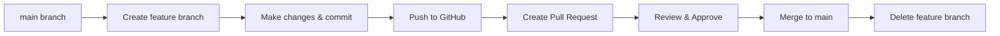

# Notes - Day 4

# 📝 Day 4 Revision Notes — Git Branching & Collaboration

*Thursday, November 23, 2024 | [Quick Reference Guide](https://www.notion.so/Notes-Day-3-2b58aa3ab31180a7ad90c83b374134fc?pvs=21)*

---

## 🌿 Git Branching — Core Concepts

<aside>
**What is a Branch?**
A branch is an independent line of development in your Git repository. Think of it as a parallel universe where you can experiment without affecting the main codebase.

</aside>

### Why Use Branches?

- **Isolation:** Work on new features without breaking the main code
- **Collaboration:** Multiple developers can work on different features simultaneously
- **Safety:** Keep the main branch stable and production-ready
- **Organization:** Each feature/fix gets its own dedicated workspace

### Branch Workflow Visualization



---

## ⚡ Essential Branch Commands

### Creating & Switching Branches

| **Command** | **What It Does** | **Example** |
| --- | --- | --- |
| `git branch` | List all branches (current marked with *) | `git branch` |
| `git branch &lt;name&gt;` | Create a new branch | `git branch feature-login` |
| `git checkout &lt;name&gt;` | Switch to a branch | `git checkout feature-login` |
| `git checkout -b &lt;name&gt;` | Create AND switch to new branch | `git checkout -b feature-login` |
| `git switch &lt;name&gt;` | Modern way to switch branches | `git switch main` |
| `git switch -c &lt;name&gt;` | Modern way to create & switch | `git switch -c feature-login` |

<aside>
💡 **Pro Tip:** Use `git checkout -b` or `git switch -c` to save time — they create and switch in one command!

</aside>

### Working with Remote Branches

| **Command** | **What It Does** |
| --- | --- |
| `git push origin &lt;branch-name&gt;` | Push your branch to GitHub |
| `git push -u origin &lt;branch-name&gt;` | Push and set upstream (do this first time) |
| `git pull origin &lt;branch-name&gt;` | Get latest changes from remote branch |
| `git branch -r` | List all remote branches |
| `git branch -a` | List both local and remote branches |

### Deleting Branches

| **Command** | **When to Use** |
| --- | --- |
| `git branch -d &lt;name&gt;` | Delete branch (safe — only if merged) |
| `git branch -D &lt;name&gt;` | Force delete (even if not merged) |
| `git push origin --delete &lt;name&gt;` | Delete branch from GitHub |

<aside>
⚠️ **Important:** Always delete feature branches after merging to keep your repository clean!

</aside>

---

## 🔄 Merging Branches

### What is Merging?

Merging combines changes from one branch into another. It's how you integrate your feature work back into the main codebase.

### Types of Merges

- **Fast-Forward Merge:** When there are no new commits on the target branch — Git simply moves the pointer forward
- **Three-Way Merge:** When both branches have new commits — Git creates a new "merge commit"
- **Squash Merge:** Combines all commits from a branch into one commit (keeps history clean)

### Merge Commands

```bash
# Step 1: Switch to the branch you want to merge INTO (usually main)
git checkout main

# Step 2: Pull latest changes
git pull origin main

# Step 3: Merge your feature branch
git merge feature-branch

# Step 4: Push the merged changes
git push origin main
```

<aside>
✅ **Best Practice:** Always pull the latest changes before merging to avoid conflicts!

</aside>

---

## 🔀 Pull Requests (PRs) — GitHub Collaboration

### What is a Pull Request?

A Pull Request is a request to merge your branch into another branch (usually main). It's GitHub's way of enabling code review and collaboration.

### Why Use Pull Requests?

- **Code Review:** Team members can review your changes before merging
- **Discussion:** Comment on specific lines of code
- **Quality Control:** Ensure code meets standards before going live
- **Documentation:** PRs create a history of why changes were made
- **CI/CD Integration:** Automated tests can run before merging

### Pull Request Workflow — Step by Step

- **Step 1: Create a Feature Branch**
    
    ```bash
    git checkout -b feature-user-authentication
    ```
    
- **Step 2: Make Changes & Commit**
    
    ```bash
    # Make your changes to files
    git add .
    git commit -m "Add user authentication feature"
    ```
    
- **Step 3: Push Branch to GitHub**
    
    ```bash
    # First time pushing this branch
    git push -u origin feature-user-authentication
    
    # Subsequent pushes
    git push
    ```
    
- **Step 4: Create Pull Request on GitHub**
    - Go to your repository on GitHub
    - Click "Pull requests" tab
    - Click green "New pull request" button
    - Select base branch (usually `main`) and compare branch (your feature branch)
    - Click "Create pull request"
    - Add a descriptive title and description
    - Click "Create pull request" again
- **Step 5: Review the PR**
    - Check the "Files changed" tab
    - Review each change carefully
    - Add comments if needed (even to your own PR)
    - Check for any merge conflicts
    - Verify all automated checks pass (if configured)
- **Step 6: Merge the Pull Request**
    - Click green "Merge pull request" button
    - Choose merge type (usually "Create a merge commit")
    - Click "Confirm merge"
    - GitHub will show "Pull request successfully merged"
- **Step 7: Delete the Branch**
    - GitHub shows "Delete branch" button after merge — click it
    - Or use command line:
    
    ```bash
    # Delete local branch
    git checkout main
    git branch -d feature-user-authentication
    
    # Delete remote branch
    git push origin --delete feature-user-authentication
    ```
    
- **Step 8: Update Your Local Main**
    
    ```bash
    # Switch to main and pull latest
    git checkout main
    git pull origin main
    ```
    

### Good PR Practices

- **Write clear titles:** "Add user authentication" not "Fix stuff"
- **Detailed descriptions:** Explain what changed and why
- **Small PRs:** Easier to review (aim for <400 lines changed)
- **Link issues:** Reference related issues with #issue-number
- **Add screenshots:** For UI changes, include before/after images
- **Self-review first:** Review your own changes before requesting review

---

## ⚠️ Merge Conflicts — Don't Panic!

### What is a Merge Conflict?

A conflict occurs when Git can't automatically merge changes because two branches modified the same lines of code differently.

### When Do Conflicts Happen?

- Two people edit the same line in a file
- One person deletes a file while another modifies it
- Changes to the same section of code in different branches

### How to Identify a Conflict

```bash
# Git will show something like this:
Auto-merging index.html
CONFLICT (content): Merge conflict in index.html
Automatic merge failed; fix conflicts and then commit the result.
```

### What a Conflict Looks Like in Your File

```html
&lt;&lt;&lt;&lt;&lt;&lt;&lt; HEAD
&lt;h1&gt;Welcome to My Website&lt;/h1&gt;
=======
&lt;h1&gt;Welcome to Our Amazing Site&lt;/h1&gt;
&gt;&gt;&gt;&gt;&gt;&gt;&gt; feature-branch
```

- `&lt;&lt;&lt;&lt;&lt;&lt;&lt; HEAD` — Your current branch's version
- `=======` — Separator
- `&gt;&gt;&gt;&gt;&gt;&gt;&gt; feature-branch` — Incoming branch's version

### Resolving Conflicts — 3 Methods

- **Method 1: Manual Resolution (Command Line)**
    
    ```bash
    # 1. Open the conflicted file in your editor
    # 2. Choose which version to keep (or combine both)
    # 3. Remove the conflict markers (&lt;&lt;&lt;&lt;&lt;&lt;&lt;, =======, &gt;&gt;&gt;&gt;&gt;&gt;&gt;)
    # 4. Save the file
    
    # 5. Stage the resolved file
    git add index.html
    
    # 6. Complete the merge
    git commit -m "Resolve merge conflict in index.html"
    
    # 7. Push changes
    git push
    ```
    
- **Method 2: GitHub Web Interface**
    - GitHub will show "This branch has conflicts" on your PR
    - Click "Resolve conflicts" button
    - Edit the file directly in GitHub's editor
    - Remove conflict markers and choose correct version
    - Click "Mark as resolved"
    - Click "Commit merge"
- **Method 3: Using VS Code**
    - VS Code highlights conflicts with colors
    - Options appear: "Accept Current Change" | "Accept Incoming Change" | "Accept Both Changes"
    - Click your choice
    - Save file, stage, and commit

<aside>
⚠️ **Golden Rule:** Never commit code with conflict markers still in it! Always test after resolving.

</aside>

### Preventing Conflicts

- **Pull often:** Keep your branch updated with main
- **Small commits:** Easier to resolve if conflicts occur
- **Communicate:** Let team know what you're working on
- **Merge main into feature:** Regularly sync your branch

```bash
# While on your feature branch:
git checkout feature-branch
git pull origin main  # Pull main into your feature branch
# Resolve any conflicts now
git push
```

---

## 🎯 Complete Workflow Example

**Scenario:** You need to add a new footer to the website

```bash
# 1. Create and switch to new branch
git checkout -b feature-add-footer

# 2. Make your changes (edit files)
# ... edit footer.html ...

# 3. Stage and commit
git add footer.html
git commit -m "Add responsive footer with social links"

# 4. Push to GitHub
git push -u origin feature-add-footer

# 5. Go to GitHub and create Pull Request
# ... create PR in browser ...

# 6. Review your changes
# ... check Files Changed tab ...

# 7. Merge the PR on GitHub
# ... click Merge button ...

# 8. Delete remote branch on GitHub
# ... click Delete branch ...

# 9. Switch to main locally
git checkout main

# 10. Pull the merged changes
git pull origin main

# 11. Delete local feature branch
git branch -d feature-add-footer

# Done! 🎉
```

---

## 📊 Branch Naming Conventions

Use clear, descriptive names for your branches:

| **Type** | **Format** | **Example** |
| --- | --- | --- |
| Feature | `feature/description` | `feature/user-login` |
| Bug Fix | `fix/description` | `fix/login-button-error` |
| Hotfix | `hotfix/description` | `hotfix/security-patch` |
| Experiment | `experiment/description` | `experiment/new-ui-design` |
| Documentation | `docs/description` | `docs/api-readme` |

---

## 🔑 Key Takeaways

<aside>
**✅ Master These Concepts:**

- [x]  Branches create isolated workspaces for development
- [x]  Always work on feature branches, never directly on main
- [x]  Pull Requests enable code review and collaboration
- [x]  Merge conflicts are normal — learn to resolve them calmly
- [x]  Delete branches after merging to keep repository clean
- [x]  Use descriptive branch names and commit messages
- [x]  Pull main frequently to minimize conflicts
</aside>

---

## ⚡ Quick Reference Cheat Sheet

```bash
# BRANCH BASICS
git branch                           # List branches
git checkout -b new-branch          # Create & switch
git push -u origin new-branch       # Push new branch
git branch -d branch-name           # Delete local
git push origin --delete branch     # Delete remote

# MERGING
git checkout main                   # Switch to main
git pull origin main                # Get latest
git merge feature-branch            # Merge feature
git push origin main                # Push merged code

# CONFLICT RESOLUTION
git status                          # Check conflicts
# Edit files to resolve
git add .                           # Stage resolved files
git commit -m "Resolve conflicts"   # Complete merge

# SYNCING FEATURE WITH MAIN
git checkout feature-branch         # Switch to feature
git pull origin main                # Pull main into feature
git push                            # Push updated feature

# PR WORKFLOW
git checkout -b feature-name        # Create branch
# Make changes
git add .
git commit -m "message"
git push -u origin feature-name     # Push to GitHub
# Create PR on GitHub
# Review, Merge, Delete branch
```

---

<aside>
🎓 **Today's Achievement:**

You now understand Git's most powerful collaboration feature! Branching and PRs are used daily by professional developers. This is real-world workflow! 🚀

**Next:** Tomorrow you'll learn system management with systemctl.
